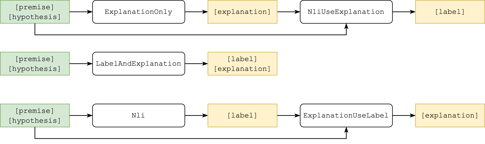

# nlp-final-project

The repository contains the final project for the course "natural Language Processing" at RUG.  
The project is base on [esnli](https://huggingface.co/datasets/esnli) dataset and focuses on analysing the variants of explanation generation.

The dataset contains text pairs `[premisis]` and `[hypothesis]` and the `[label]` of the pair: entailment, contradiction or neutral. IN addition each pain acomplished with `[explanation]` on a natural language.   
The task is to generate the explanation and label for the given pair.

The project is analysing three main approaches:
* Generating explanation using saparate model and then predict label using the explanation
* Jointly generate label and explanation using the same **text** generation model
* Predict label using saparate model and then generate explanation having label as input




## Installation

Note: python 3.9 is required

Create a virtual environment and install the requirements
```shell
python -m venv .venv
python -m pip install -r requirements.txt
```


## Cluster

The High Performance Computing cluster [Hábrók](https://www.rug.nl/society-business/centre-for-information-technology/research/services/hpc/facilities/peregrine-hpc-cluster) of the RUG was used for models training and experiments. 

The `.sh` scripts for running the experiments on the cluster are located in each `scripts/` subfolder, the setup instruction is available as `scripts/README.md`.

## Structure 

* `scripts/classification` - contains training scripts for each any classification model used.
* `scripts/generation` - contains training scripts for each any explanation generation model used.
* `scripts/pipeline` - contains scripts to evaluate models than requires other models predictions as input.

Training scripts accept the following arguments:
* `--base-model` - model to finetune available at Hugginface Hub (e.g. `roberta-base`)
* `--config-name` - name of the config in `params.json` file (separate for each script)
* `generation_type`/`classification_type` - type of trainin process, whatever use or not explanation or lable in input data

See more `python [script_name].py --help`

